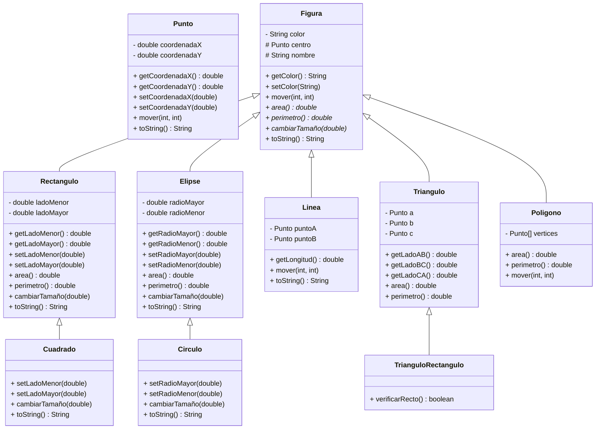

```mermaid
classDiagram

class Punto {
  - double coordenadaX
  - double coordenadaY
  + getCoordenadaX() double
  + getCoordenadaY() double
  + setCoordenadaX(double)
  + setCoordenadaY(double)
  + mover(int, int)
  + toString() String
}

class Figura {
  - String color
  # Punto centro
  # String nombre
  + getColor() String
  + setColor(String)
  + mover(int, int)
  + area() double*
  + perimetro() double*
  + cambiarTamaño(double)* 
  + toString() String
}

class Rectangulo {
  - double ladoMenor
  - double ladoMayor
  + getLadoMenor() double
  + getLadoMayor() double
  + setLadoMenor(double)
  + setLadoMayor(double)
  + area() double
  + perimetro() double
  + cambiarTamaño(double)
  + toString() String
}

class Elipse {
  - double radioMayor
  - double radioMenor
  + getRadioMayor() double
  + getRadioMenor() double
  + setRadioMayor(double)
  + setRadioMenor(double)
  + area() double
  + perimetro() double
  + cambiarTamaño(double)
  + toString() String
}

class Cuadrado {
  + setLadoMenor(double)
  + setLadoMayor(double)
  + cambiarTamaño(double)
  + toString() String
}

class Circulo {
  + setRadioMayor(double)
  + setRadioMenor(double)
  + cambiarTamaño(double)
  + toString() String
}

class Linea {
  - Punto puntoA
  - Punto puntoB
  + getLongitud() double
  + mover(int, int)
  + toString() String
}

class Triangulo {
  - Punto a
  - Punto b
  - Punto c
  + getLadoAB() double
  + getLadoBC() double
  + getLadoCA() double
  + area() double
  + perimetro() double
}

class TrianguloRectangulo {
  + verificarRecto() boolean
}

class Poligono {
  - Punto[] vertices
  + area() double
  + perimetro() double
  + mover(int, int)
}

Figura <|-- Rectangulo
Figura <|-- Elipse
Rectangulo <|-- Cuadrado
Elipse <|-- Circulo
Figura <|-- Linea
Figura <|-- Triangulo
Triangulo <|-- TrianguloRectangulo
Figura <|-- Poligono

```